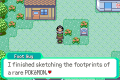

# Tutorial: Name Box

This feature branch implements a name box in the style of the one in @tustin2121's [Trick-or-Treat House](https://www.pokecommunity.com/showthread.php?p=10566982) hack.

## Features: 
- Implementation of a name plate attached to the dialog box.
- New command `speakername [textPointer]` to set the name of the speaker to display in the box.
	- Setting the speaker name to `NULL` hides the name plate.
	- Speaker name is automatically set to `NULL` in the `closemessage` command.
- Assign a flag from `include/constants/flags.h` to `OW_FLAG_SUPPRESS_SPEAKER_NAME` to dynamically disable/enable the nameplates.
	- ie: 
	```c
	#define OW_FLAG_SUPPRESS_SPEAKER_NAME			FLAG_UNUSED_0x881
	```
- All trainers capable of trainer sight battles automatically have their trainer name as the speaker name when talking to them or being seen by them.

## Example setup:
1. Declare a name in the script to use, in this case "Mom":
```c
CommonName_Text_Mom:
	.string "Mom$"
```
2. Now, set the speaker name before the messagebox block is called before any relevant dialog boxes:
```c
LittlerootTown_EventScript_GiveRunningShoes::
	speakername CommonName_Text_Mom
	msgbox LittlerootTown_Text_WearTheseRunningShoes, MSGBOX_DEFAULT
	playfanfare MUS_OBTAIN_ITEM
	<...etc, rest of block>
```
3. Enjoy your nameboxes!





> [!NOTE]
> Feature created by @tustin2121, and ported to expansion by @surskitty and @khbsd.